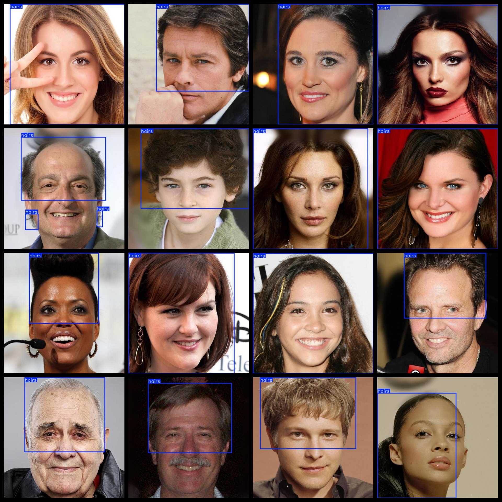
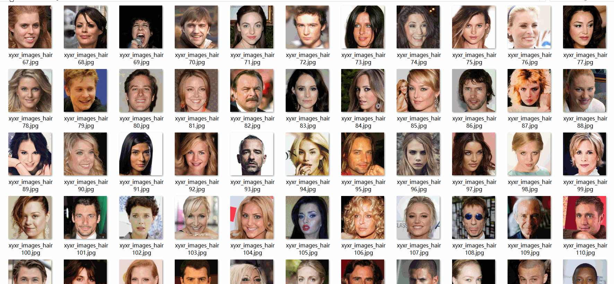

# Hair Detection Dataset 3169 imagesVOC+YOLO format

The hair detection dataset consists of 3169 images in the format of VOC+YOLO.

Dataset format: Pascal VOC format + YOLO format (the txt file does not contain the split path, it only contains jpg images and corresponding VOC format xml files and yolo format txt files)

Number of image files (jpg): 3169

Number of xml files: 3169

Number of txt files: 3169

Number of categories: 1

The Github repository is: datasets_sl

["hairs"]

Number of boxes labeled in each category:

Hairs frame = 3601

Total frames: 3601

Number of images per category:

Hairs occupies a picture count = 3169

Image Resolution: 512x512

Use the labeling tool: labelImg

Dataset Augmentation: No

Rules for annotation: Draw a rectangle around the category.

Important note: The dataset does not have been divided into training, validation, and testing sets.

Special Disclaimer: This dataset does not guarantee the accuracy of the trained models or weight files.

Annotation and image details are as follows:

## Images

---

Here is a pay link on Stripe (https://buy.stripe.com/3cs8yP7sY87d0vu9AB). Please contact me lonlonago@foxmail.com after funding $89, and I will send you a complete data files, thank you!

